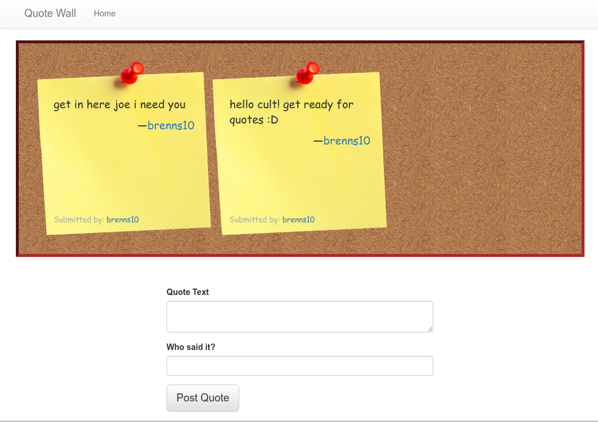
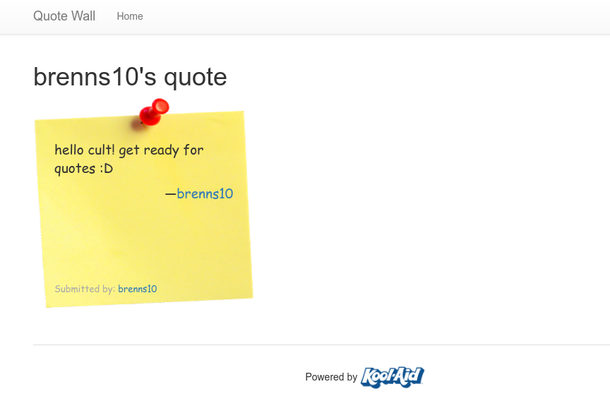

Quote Wall
==========

This is a simple Flask web application that lets users post quotes to a "quote
wall". Upcoming features include:

- star ratings on quotes
- commenting on quotes
- more inside jokes

There are many CRUD webapps that can do this sort of thing. But this one is
mine.

Screenshots
-----------

### Main Page

### Quote detail

Instructions
------------

TODO :)
